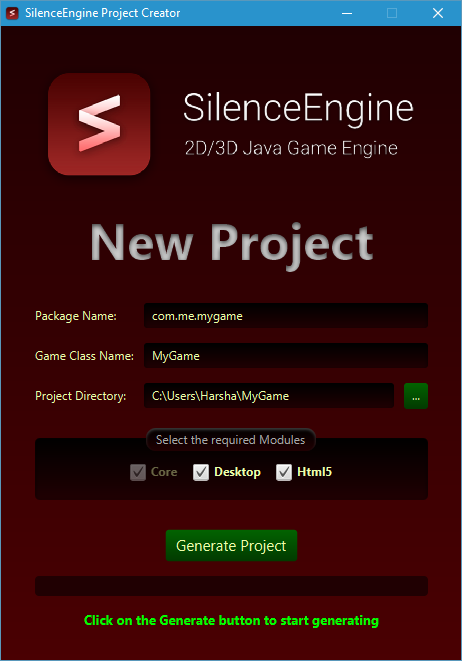

# SEProjectCreator

A project creator tool for multi backend SilenceEngine projects

SilenceEngine is a cross platform game engine, and uses Gradle to create the project. When multiple targets are there, it becomes slow to start a new project, and that's why this tool is made. It let's you to get up immediately by providing a head start.

## Download

The download binary is hosted on my website, at the URL [http://silenceengine.goharsha.com/downloads/SEProjectCreator.jar](http://silenceengine.goharsha.com/downloads/SEProjectCreator.jar). Whenever SilenceEngine is updated (for major releases) this tool will be updated with the binaries.

## Building manually

Alternatively, you can clone this repository, and build it yourself. If you want to update the libraries, replace the existing ones in the `src\main\resources\templates\libs\` directory and the new build will contain them.